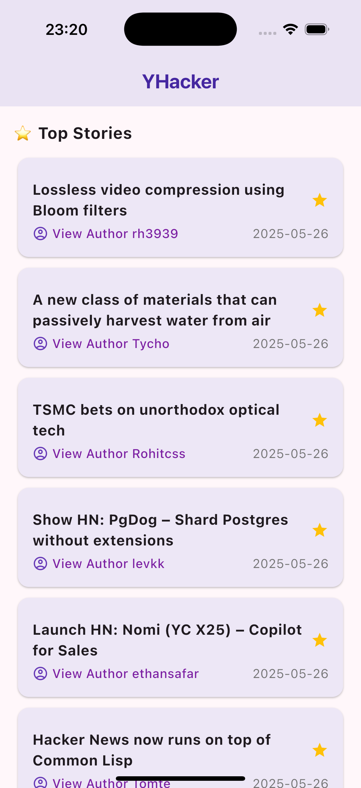
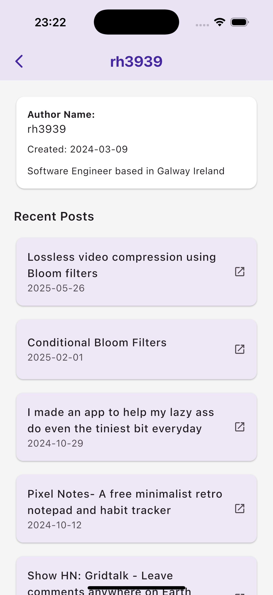

# YHacker

**YHacker** is a cross-platform mobile application built using Flutter that allows users to browse top stories from [Hacker News](https://news.ycombinator.com/). Users can view story details, open articles in a browser, and view author profiles with their submitted posts.

## 🚀 Features

- 🔥 View top stories from Hacker News
- 📖 See story details (title, author, timestamp)
- 🌐 Open story links in the browser
- 👤 View author profiles with:
    - Account info (username, creation date, about section)
    - List of submitted posts with links

## 🛠️ Tech Stack

This app is built using Flutter and modern architecture tools for scalable and maintainable code.

### 🗂️ State Management & Architecture
- **Riverpod** – For state management and dependency injection
- **go_router** – For declarative, type-safe navigation
- **Dio** – For HTTP networking
- **Retrofit** – For clean API integration and strongly typed requests
- **Freezed** – For immutable data models and union types
- **json_serializable** – For automatic JSON parsing
- **url_launcher** – For opening URLs in the browser

## 📦 Folder Structure
```
lib/
├── main.dart
├── core/
│   ├── network/
│   │   ├── api_client.dart
│   │   └── api_service.dart
│   └── router/
│       └── app_router.dart
├── models/
│   ├── story.dart
│   └── user.dart
├── providers/
│   ├── story_provider.dart
│   └── user_provider.dart
├── screens/
│   ├── home_screen.dart
│   └── user_detail_screen.dart
├── widgets/
│   └── story_tile.dart
```

## 📡 API

Powered by the official [Hacker News Firebase API](https://github.com/HackerNews/API)

## 📱 Platforms

- Android
- iOS

## 🧪 Future Improvements

- Animations for transitions
- Pagination support
- Pull-to-refresh
- Theme switching

---

## 🛠 Setup Instructions

1. Clone the repo:
   ```bash
   git clone https://github.com/sunalii/lv-hackmotion-swing-scope.git
   cd lv-hackmotion-swing-scope

2. Install dependencies:
   ```bash
   flutter pub get

3. Run the app:
   ```bash
   flutter run

© 2025 Sunali Rambukwella. All rights reserved.

## 📱 Screenshots




